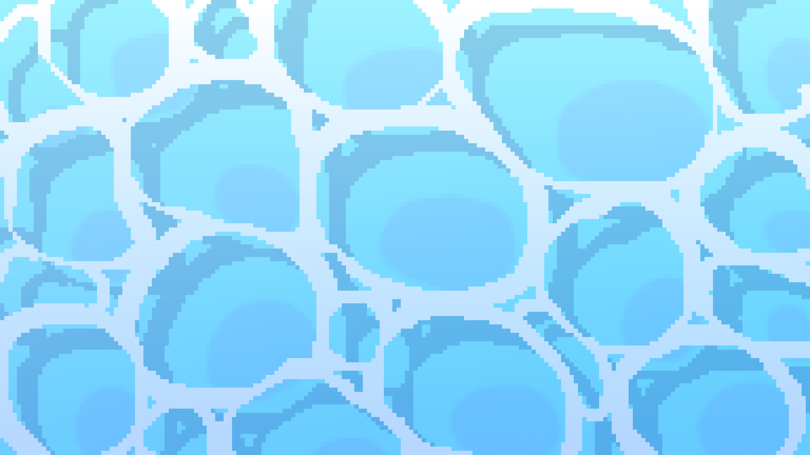

# Duck Pond

Duck Pond is a lightweight browser-based canvas experiment that fills the screen with animated ducks, lets you tweak their size and speed, and enables or disables duck-to-duck collisions. The project is intentionally simple: it serves as a playful interactive scene built with plain HTML, CSS, and JavaScript.

## What this project does

This project creates a full-screen animated pond scene where:

- A background image is rendered behind the canvas.
- A large number of ducks are spawned and continuously animated across the viewport.
- The mouse position influences duck movement, causing nearby ducks to steer toward the cursor.
- You can adjust the duck size and movement speed with the controls panel.
- You can toggle collisions on or off.
- Clicking anywhere on the canvas spawns an additional duck.
- The "Disintegrate Duck" button removes a duck and creates particle effects that simulate it breaking apart.

## How it works

### 1. Page structure

The app uses a very small static structure:

- [index.html](index.html) contains the settings panel, the canvas element, and the background layer.
- [style.css](style.css) defines the full-screen layout, the animated pond background, and the styling of the control panel.
- [script.js](script.js) handles the canvas animation loop, duck behavior, UI events, and particle effects.

### 2. Animation loop

The animation is driven by `requestAnimationFrame`, which repeatedly:

1. Clears the canvas.
2. Updates each duck’s position and orientation.
3. Applies collision logic when enabled.
4. Draws ducks to the canvas.
5. Updates and renders particle effects for disintegration.

### 3. Duck behavior

Each duck object has:

- A random angle and movement speed variation.
- A size based on the slider setting and a random size multiplier.
- A turn speed that allows it to steer toward the cursor when the pointer is near.
- Boundary checks so ducks bounce off the screen edges.

### 4. UI controls

The settings panel exposes a few simple controls:

- Duck Size slider: adjusts the size of all ducks.
- Duck Speed slider: changes the base movement speed.
- Duck collisions checkbox: enables or disables collision behavior.
- Disintegrate Duck button: removes a random duck and creates a burst of particles.

## File structure

```text
duck-world/
├── assets/
│   ├── background.png
│   └── duck.png
├── index.html
├── script.js
├── style.css
└── README.md
```

## Assets

The project uses the following files from the assets folder:

- [assets/background.png](assets/background.png) — the pond/scene background image.
- [assets/duck.png](assets/duck.png) — the sprite used for rendering each duck.

## Screenshots

The project can be documented with screenshots of the main scene and settings panel. Add images like the following when available:



> Add more screenshots here as the project evolves, such as a close-up of the settings panel or a frame showing the particle effect after disintegration.

## Run locally

You can open [index.html](index.html) directly in a browser, or serve the project from a simple local server:

```bash
python -m http.server 8000
```

Then visit http://localhost:8000/

## Future ideas

Possible enhancements for the project include:

- Adding sound effects and water ripple animations.
- Supporting different duck colors or sprite variants.
- Introducing food and feeding interactions.
- Making the paddling movement more natural with smoother physics.
- Adding more UI polish and a dark/light mode toggle.
